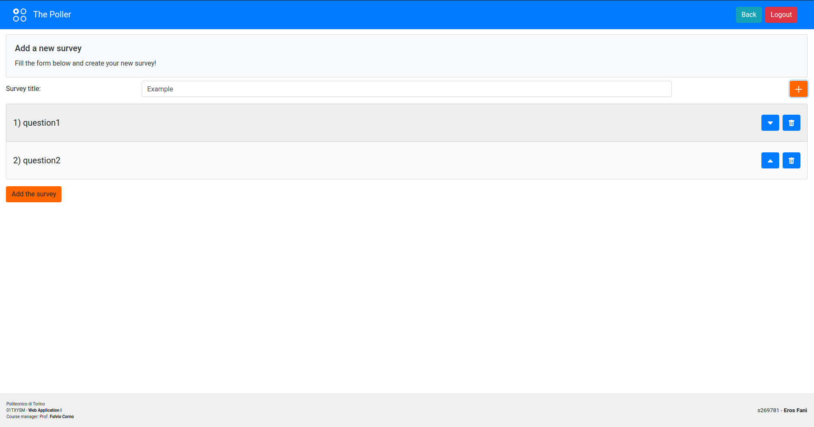

# Exam #1: "Survey"
## Student: s269781 FANÌ EROS 

## React Client Application Routes

| Route | Content & Purpose | Param specification |
|-------|-------------------|---------------------|
| `/`   | Homepage of the user. It contains the list of published surveys and their author. Each row is a link to a specific survey | - |
| `/survey/<id>` | Survey questions of id `id`. Here a user may fill a survey | `id`: id of that specific survey. It is an iterative identificator, independently from the author (i.e. the first submitted survey has `id=1`, the second `id=2` and so on) |
| `/login` | Authentication form for an admin. It allows to switch from user mode to admin mode | - |
| `/admin-panel` | Homepage of the admin. It contains the list of the surveys published by the authenticated admin. Each row is a link to the answers report for that specific survey | - |
| `/admin-panel/survey/<id>` | Answers of the users for the survey with id `id`. Navigation among different responses (users) is allowed through arrow buttons which are visible only when needed (more than one response) | `id`: id of that specific survey |
| `/admin-panel/new-survey` | It allows the admin to add a new survey. New questions can be added by pressing the `+` button. The button for the final submission of the survey is visible only if there is at least a question | - |

## API Server

DISCLAIMER: only the types for POSTs body request fields are specified to ease their testing

- POST `/api/session`
  - allows the login with Passport
  - request body content:
    ```json
    {"username": "<admin_name>", "password": "<admin_password>"}
    ```
      - `<admin_name>`: string
      - `<admin_password>`: string
  - response body content:
    ```json
    { "id": "<logged admin id>",
      "username": "<logged admin name>",
      "num_surveys": "<logged admin num surveys>" }
    ```
- GET `/api/sessions/current`
  - if authenticated, returns the athenticated admin info in the following format:
    ```json
    { "id": "<logged admin id>",
      "username": "<logged admin name>",
      "num_surveys": "<logged admin num surveys>" }
    ```
- DELETE `/api/sessions/current`
  - the browser send a logout request to the server
  - the server will clear the session (and delete the stored session id)
- GET `/api/surveys`
  - returns the list of surveys and their properties in the following format:
    ```json
    [
      { "id": "<survey id>",
        "title": "<survey title>",
        "admin": "<survey author>",
        "num_questions": "<survey num questions>" },
      {...},
      ...
    ]
    ```
- GET `/api/survey/<survey_id>`
  - returns the properties of a specific survey with `survey_id = <survey_id>` in the following format:
    ```json
    { "title": "<survey_title>",
      "admin": "<survey author>",
      "num_questions": "<survey num questions>" }
    ```
- GET `/api/survey/<survey_id>/num_responses`
  - returns the number of responses to the survey with `survey_id = <survey_id>` if authenticated and authorized (i.e. if that survey belongs to the authenticated administrator) in the following format:
    ```json
    { "survey_id": "<survey id>",
      "admin_id": "<admin (to which the survey belongs) id>",
      "title": "<survey title>",
      "num_responses": "<survey num responses>" }
    ```
- GET `/api/surveys/num_responses`
  - returns the number of responses to each survey which belongs to the authenticated administrator, in the following format:
    ```json
    [
      { "survey_id": "<survey id>",
        "title": "<survey title>",
        "admin_id": "<admin (to which the survey belongs) id>",
        "num_responses": "<survey num responses>" },
      {...},
      ...
    ]
    ```
- POST `/api/survey/<survey_id>`
  - allows the saving of the responses to a survey on the database
  - request body content:
    ```json
    { "survey_id": "<survey id>",
      "user": "<name of the user>",
      "answers": [
        { "question_id": "<question_id>", "text": "<open question text answer>" },
        { "question_id": "<question_id>", "option_id": "<closed question option id>" },
        {...},
        ...
      ] }
    ```
      - `<survey id>`: string (passed for simplicity in the application since it is needed in API.js to set the `<survey_id>` parameter in the url, but not mandatory for the single post)
      - `<name of the user>`: string
      - `<question_id>`: integer
      - `<open question text answer>`: string
      - `<closed question option id>`: integer
  - observe that more than one element of the answers'list with the same question_id is allowed for the multiple options selection of a closed question
  - response body content:
    ```json
    { "title": "<survey_title>",
      "admin": "<survey admin name>",
      "num_questions": "<survey_questions>" }
    ```
  - response (success): `201 CREATED`
- GET `/api/survey/<survey_id>/questions`
  - returns the list of questions of the survey with `survey_id = <survey_id>` in the format of the following example:
    ```json
      [
        { "id": 1,
          "is_closed": 0,
          "title": "What is the title of the composition you are reviewing?",
          "min": 1,
          "max": 1,
          "num_options": null
        },
        {...},
        ...,
        { "id": 5,
          "is_closed": 1,
          "title": "Do the ideas or events follow in logical order?",
          "min": 1,
          "max": 1,
          "num_options": 2,
          "options": [
            { "id": 1, "option": "yes" },
            { "id": 2, "option": "no" }
          ]
        },
        {...},
        ...
      ]
    ```
  - observe that:
    - is_closed == 0 &#8594; num_options != 0, options is defined, options.length == num_options
    - is_closed == 1 &#8594; num_options = null, options is not defined
- GET `/api/survey/<survey_id>/question/<question_id>`
  - returns the question with `question_id = <question_id>` of the survey with `survey_id = <survey_id>` in the format of the following examples:
    ```json
      { "survey_id": 1,
        "question_id": 1,
        "is_closed": 0,
        "title": "What is the title of the composition you are reviewing?",
        "min": 1,
        "max": 1,
        "num_options": null }
    ```
    or
    ```json
      { "survey_id": 1,
        "question_id": 5,
        "is_closed": 1,
        "title": "Do the ideas or events follow in logical order?",
        "min": 1,
        "max": 1,
        "num_options": 2 }
    ```
    depending on the value of `is_closed`
- GET `/api/survey/<survey_id>/question/<question_id>/options`
  - returns the list of options for the question with `question_id = <question_id>` of the survey with `survey_id = <survey_id>` if the question is closed, in the following format:
    ```json
      [{"id": "<option id>", "option": "<option text>"}, {...}, ...]
    ```
- GET `/api/survey/<survey_id>/question/<question_id>/option/<option_id>`
  - returns the option woth `option_id = <option_id>` for the question with `question_id = <question_id>` of the survey with `survey_id = <survey_id>` if the question is closed, in the following format:
    ```json
    { "survey_id": "<survey id>",
      "question_id": "<question id>",
      "option_id": "<option id>",
      "option": "<option text>" }
    ```
- GET `/api/surveys/maxid`
  - returns the current maximum `answers_id` among both the tables `ClosedAnswers` and `OpenAnswers` in the following format:
    ```json
    { "max_id": "<maximum id>" }
    ```
- GET `/api/survey/<survey_id>/answers`
  - returns thelist of answers to the survey with `survey_id = <survey_id>` if authenticated and authorized (i.e. if that survey belongs to the authenticated administrator) in the following format:
    ```json
    { "<answer_id>": {
        "user": "<name of the user>",
        "answers": {
          "<question_id>": "<list of selected options (if the question is closed)>",
          "<question_id>": "<textual answer (if the question is open)>",
          ...
        }
      },
      "<answer_id>": {...},
      ...
      "admin_id": 3 }
    ```
- POST `/api/survey`
  - allows the saving of a new survey on the database
  - works if the admin is authenticated 
  - request body content:
    ```json
      { "title": "<survey title>",
        "questions": [
          { "title": "<question title>", "is_closed": 0, "max": "<max>", "min": "<min>" },
          { "title": "<question title>", "is_closed": 1, "max": "<max>", "min": "<min>", "options": [
              "<title option 1>",
              "<title option 2>",
              ...
            ],
            "num_options": "<num options>"
          },
          {...},
          ...
        ]
      }
    ```
      - `<survey title>`: string
      - `<question title>`: string
      - `<max>`: integer
      - `<min>`: integer
      - `<title option n>`: string
      - `<num options>`: integer
  - response (success): `201 CREATED`

## Database Tables

```sql
Admins (
    admin_id    INTEGER PRIMARY KEY
                        NOT NULL,
    name        STRING  NOT NULL,
    password    STRING  NOT NULL,
    num_surveys INTEGER NOT NULL
);
```

- `admin_id` starts from 1
- `name`: username of the administrator
- `password`: bcrypt hash of the password (10 rounds)

```sql
Surveys (
    survey_id     INTEGER PRIMARY KEY
                          NOT NULL,
    title         STRING  NOT NULL,
    admin_id      INTEGER REFERENCES Admins (admin_id) 
                          NOT NULL,
    num_questions INTEGER NOT NULL
);
```

- `survey_id` starts from 1

```sql
Questions (
    survey_id   INTEGER REFERENCES Surveys (survey_id) 
                        NOT NULL,
    question_id INTEGER NOT NULL,
    is_closed   BOOLEAN NOT NULL,
    title       STRING  NOT NULL,
    min         INTEGER NOT NULL,
    max         INTEGER NOT NULL,
    num_options INTEGER,
    PRIMARY KEY (
        survey_id,
        question_id
    )
);
```

- `question_id` restarts from 1 for each `survey_id`
- if `is_closed` == 0 (*open question*):
  - `min` == `max` == 0 &#8594; *optional*
  - `min` == `max` == 1 &#8594; *mandatory*
  - `num_options` is NULL

```sql
Options (
    survey_id   INTEGER NOT NULL
                        REFERENCES Surveys (survey_id),
    question_id INTEGER NOT NULL,
    option_id   INTEGER NOT NULL,
    option      STRING  NOT NULL,
    PRIMARY KEY (
        survey_id,
        question_id,
        option_id
    )
);
```

- (`survey_id`, `question_id`) correspond to an existing question of an existing survey (handled server-side)
- `option_id` restarts from 1 for each `question_id`

```sql
ClosedAnswers (
    answers_id  INTEGER     NOT NULL,
    question_id INTEGER     NOT NULL,
    option_id   INTEGER     NOT NULL,
    survey_id   INTEGER     NOT NULL
                            REFERENCES Surveys (survey_id),
    user        STRING (50) NOT NULL,
    PRIMARY KEY (
        answers_id,
        question_id,
        option_id
    )
);

OpenAnswers (
    answers_id  INTEGER      NOT NULL,
    question_id INTEGER      NOT NULL,
    survey_id   INTEGER      NOT NULL
                             REFERENCES Surveys (survey_id),
    user        STRING (50)  NOT NULL,
    text        STRING (200) NOT NULL,
    PRIMARY KEY (
        answers_id,
        question_id
    )
)
```

- `answers_id` starts from 1. It is the identifier of a unique survey submission, i.e. it is the same id for all the answers to that survey for that submission
- (`question_id`, `option_id`, [`survey_id`]) correspond to an existing option of an existing question [of an existing survey] (handled server-side)

## Main React Components

- `NavigationBar` (in `NavigationBar.js`): always visible; allow navigation throughout most of the routes; buttons depend on the current route
- `Headline` (in `utils.js`): grey textual area at the top of most of the routes, provided with a title and a description
- `Footer` (in `utils.js`): always visible; footer at the end of the page
- `ActiveSurveys` (in `ActiveSurveys.js`): `Headline` + list of all the published surveys, with their title and author (the admin who published that survey); visible on `/`; each row is a link to the compilation form of that survey (`/survey/<id>`)
- `SurveyRow` (in `utils.js`): single row for the list of surveys in `/` and the list of surveys in `/admin-panel`
- `UserField` (in `survey/id/FillSurvey.js`): horizontal component with a text area to insert the name of the user who is filling the survey
- `Question` (in `survey/id/Question.js`): Box component provided with:
  - a `QuestionHeader` component for the title and the constraints of the question
  - the list of options for that questions (`ClosedQuestionField`) or the text area to answer `OpenQuestionField` if the question is closed or open respectively
- `FillSurvey` (in `survey/id/FillSurvey.js`): wraps the `Headline`, the `UserField` and the `Question`s for the survey. It allows the submission of the answers through a submission button iff all the constraints are satisfied  
- `Login` (in `login/Login.js`): login components (`Headline`, text areas for the username and the password of the admin and the Login button)
- `AdminPanel` (in `admin-panel/AdminPanel.js`): `Headline` + list of all the surveys published by the logged admin, with their title and the number of total responses; each row is a link to the users' responses to that survey (`/admin-panel/survey/<id>`)
- `SurveyResponses` (in `admin-panel/survey/id/SurveyResponses.js`): shows the users' responses of a survey; navigation between responses is allowed through arrow buttons; below, the list of answers is shown
- `AddQuestion` (in `admin-panel/new-survey/AddQuestion`): `Modal` for the insertion of a new question for a new survey. At first, only the question title and the question type may be defined; then, a personalized interface for the particular type of question appears. Note that "Maximum number of answers accepted" (max) and "Minimum number of answers accepted" (min) selections depend on the current number of options and on their reciprocal values, as follows: _0 ≤ min ≤ max ≤ num_options ∧ max ≥ 1_ (so it is never possible to select a not valid combination of constraints) 
- `NewSurvey` (in `admin-panel/new-survey/NewSurvey`): wraps the `Headline` and a `TitleField` component made of a text area for the name of the new survey and a plus button; each time the admin clicks the plus button, the `AddQuestion` modal is shown. A list of `AddedQuestion`s is shown in real time. The button for the submission of the survey appears only if there is at least a question in the survey.

## Screenshots




## Admins Credentials

| Admin name | Password   |
|------------|------------|
| admin1     | password1! |
| admin2     | password2! |
| admin3     | password3! |
| admin4     | password4! |

## Admins Surveys

| Survey                     | Admin  |
|----------------------------|--------|
| Compositions               | admin1 |
| Book Club Choices          | admin1 |
| Report Card for Mrs. Purdy | admin2 |
| Bicycle usage              | admin3 |
| Big event coming!          | admin2 |
| Bug Tracker                | admin2 |
| What do you think about... | admin3 |

No surveys for admin4

## Notes

- API error code responses are various and depend on the type of error (not authenticated, bad request body...) and on the particular API
- usernames (normal user) shorter than 3 characters or with spaces are not allowed
- question titles shorter than 3 characters are not allowed
- `svgs.js` contains the svgs for the buttons and the logo
